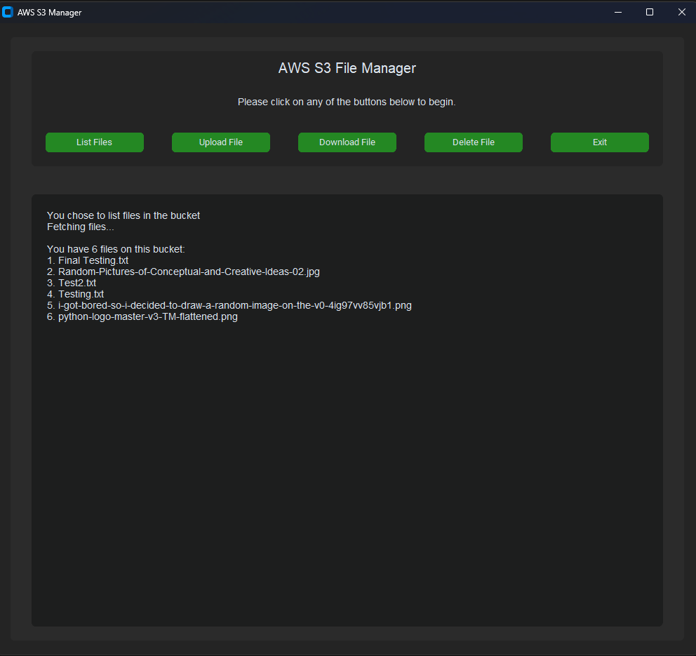
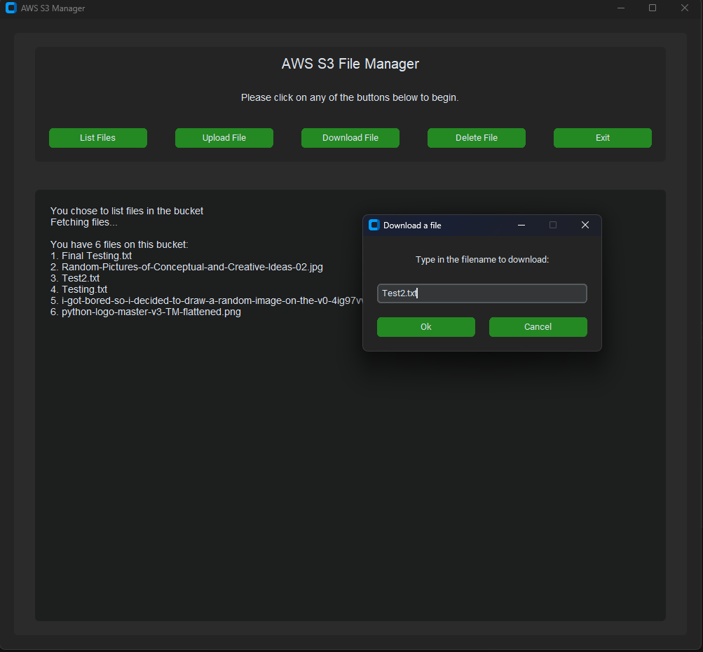
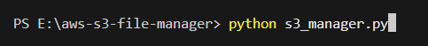

# AWS S3 File Manager
- A Python project that interacts with a AWS S3 bucket to upload, list, download, and delete files.
- Libraries used: Boto3, Custom Tkinter, Tkinter.

NOTES:
- This only works with my own S3 bucket and credentials.
- If you know what your doing, you can absolutely modify this to work for you. Just create your own S3 bucket, import your credentials, and change the bucket name in the code.

## How It Works:
The program uses the Boto3 Python library to interact with an AWS S3 bucket. For the UI, I used custom Tkinter and Tkinter.
1) List Files: Simply lists all the files currently in the bucket.
2) Upload File: Open a windows dialog box to select the file you want to upload.
3) Download File: Opens a custom dialog window to type in the filename you wish to download.
4) Delete File: Open a custom dialog window to type in the filename you wish to delete.
5) Exit: Exits the program

NOTES:
- You will need to modify the code to work for you, otherwise the program won't work. If you're ok, proceed to instructions.

## Intstructions:
1) Download / clone the repository
2) Extract files if downloading via GitHub
3) CD into the project directory using command line or open the folder
4) Run the program using the command line

